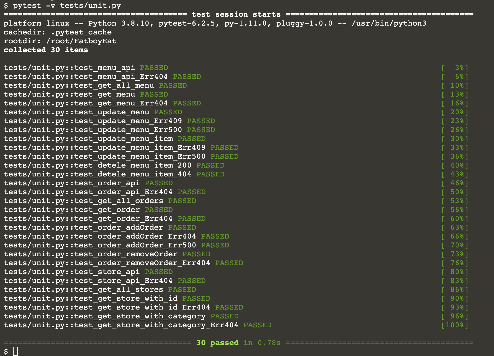

## Test the appliction

1.  Open a new terminal

2.  Install pytest
    `pip install pytest`{{execute}}

3.  Then Go inside the repository 
    `cd FatboyEat`{{execute}}

4.  Run the test
    `pytest tests/unit.py`{{execute}}
    If all the test are passed, the terminal will display '30 passed'.
    

4.  Run the test to show all the details
    `pytest -v tests/unit.py`{{execute}}
    