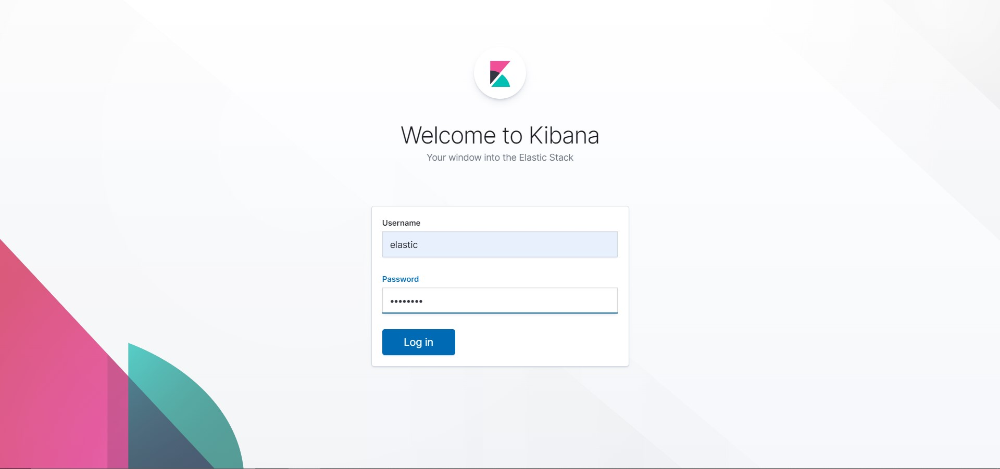
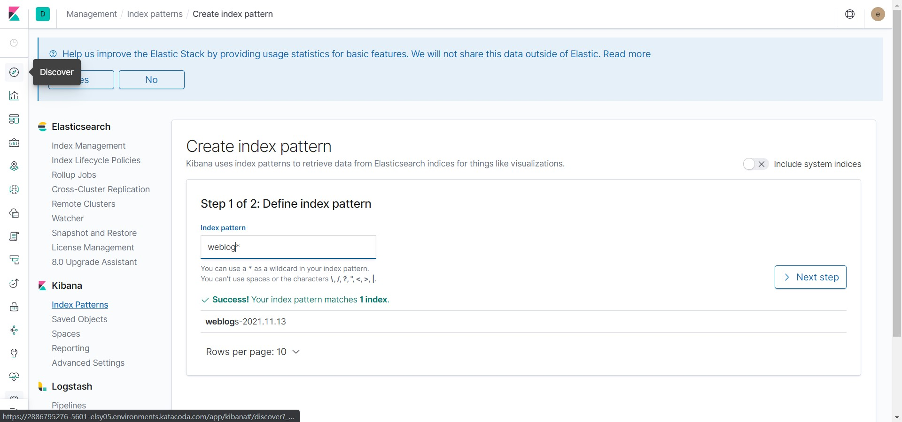
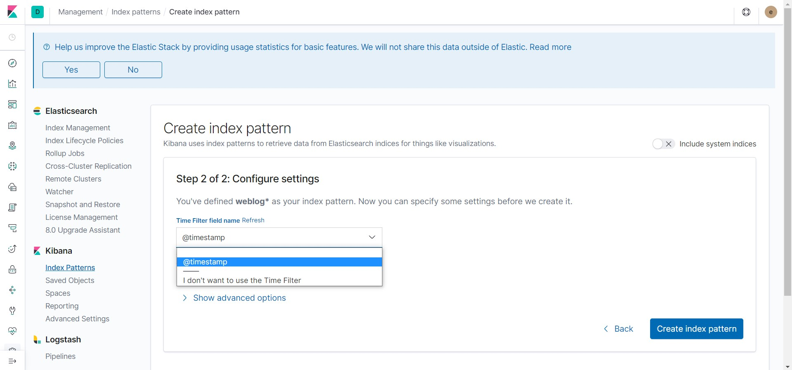
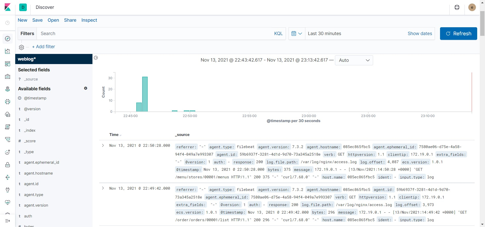

## ELK

1.  View the Kibana at localhost:5601:
    https://[[HOST_SUBDOMAIN]]-5601-[[KATACODA_HOST]].environments.katacoda.com

2.  Login using username `elastic` and password `changeme`.
    

3.  Click `Discover` in the menu bar. Then type `weblog` in index pattern. Click the `Next step` button.
    

4.  Choose `@timestamp` for configure settings. Then click the `Create index pattern` button.
    

5.  Click `Discover` in the menu bar to view the weblog information.
    