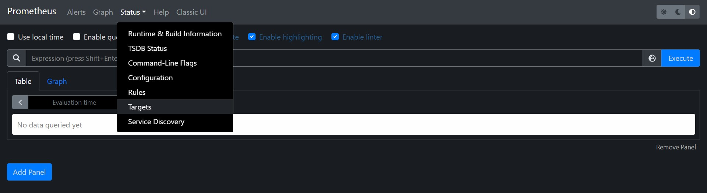
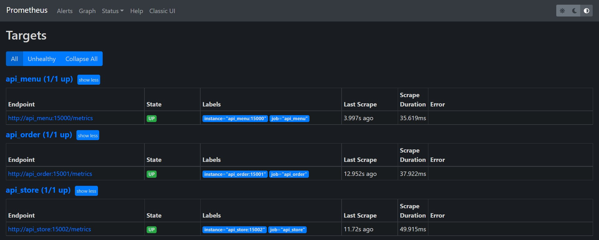

## Prometheus

1.  View the Prometheus at localhost:9090:
    https://[[HOST_SUBDOMAIN]]-9090-[[KATACODA_HOST]].environments.katacoda.com

2.  Choose `Targets` in `Status` in the menu bar.
    

3.  Check the state of the targets endpoint is `UP`.
    
