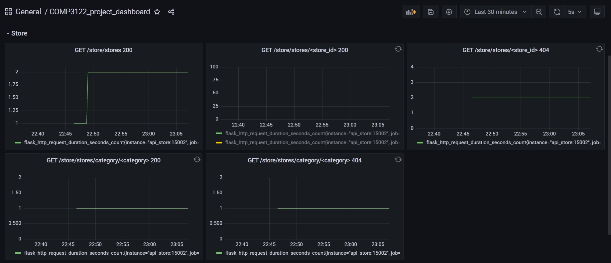

## Grafana

1.  View the Grafana at localhost:3000:
    https://[[HOST_SUBDOMAIN]]-3000-[[KATACODA_HOST]].environments.katacoda.com

2.  Login using username `admin` and password `admin`.
    

3.  Click `Dashboards` in the menu bar. Then choose `Manage`. Click `COMP3122_project_dashboard` to view the visualization of the metrics collected by Prometheus.
    

4.  View the dashboards of different endpoints.
    
    
    
    
    
    