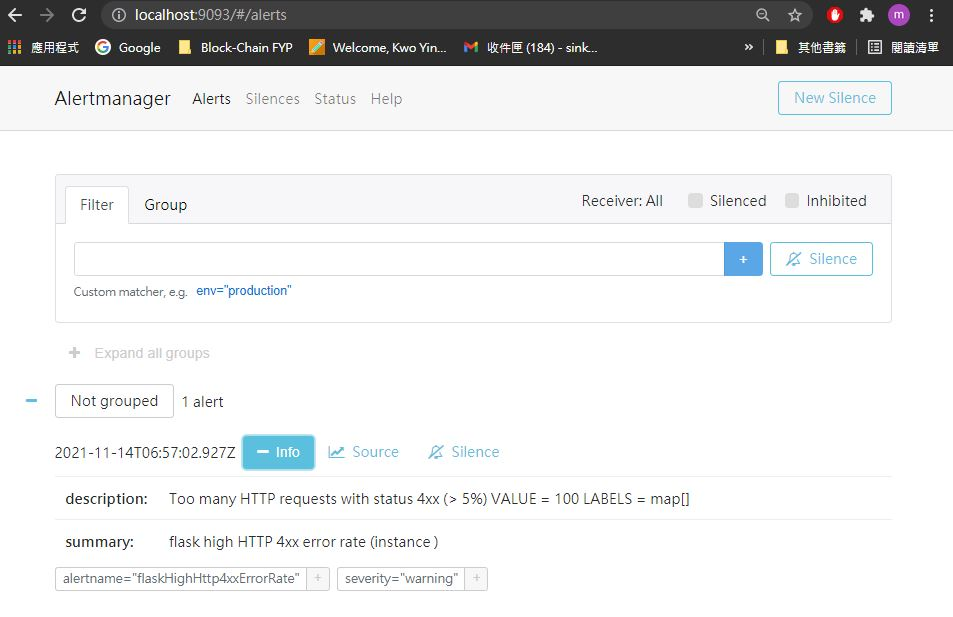

## Alert Manager

Open a new window

1.  View the Promethuse at localhost:9090:
    https://[[HOST_SUBDOMAIN]]-9090-[[KATACODA_HOST]].environments.katacoda.com

2.  Choose `Rules` in `Status` in the menu bar.
    

3.  Inside the rules, you will see the Alert Rules that contain in promethuse.
      

4.  Choose `Alerts` in the menu bar.
    Now you will see the status for all rules in promethuse.
    

5.  Now, we simulate there is too many error response (4xx/5xx).
    1.  Back to the Katacoda webpage, open a new terminal.
        

    2.  Run few error request to make the error reponse > 5%
        `curl http://localhost:20080/menu/stores/123/menus`{{execute}}
        `curl http://localhost:20080/menu/stores/123/menus`{{execute}}

        

    3.  Wait ~ 30s, back to the promethus 
        The rules of check 4XX reponse code statuse will return to `Pending`
        

    4.  After ~ 30s it will check the rules again, if the 4XX-response code is still > 5%.
        The rules of check 4XX reponse code statuse will return to `Firing`
        

    5.  View the Alertmanger at localhost:9093:
        You will see the alert details.
    https://[[HOST_SUBDOMAIN]]-9093-[[KATACODA_HOST]].environments.katacoda.com
        

6.  Now, we simulate there is a micoservice "DOWN".
    1.  Back to the Katacoda webpage, open a new terminal.
         

    2.  Remove either one microservice container
        `docker rm -f api_menu`{{execute}}

        

    3.  Wait ~ 1min, back to the promethus 
        The rules of check service 'DOWN' statuse will return to `Pending`
        

    4.  After ~ 1min it will check the service again, if it still in 'DOWN' status. The alert will return to `Firing`
        

    5.  You will receive an email for the alert message.
        

7.  Remove all the container and images.
    `docker-compose down -v --rmi all`{{execute}}